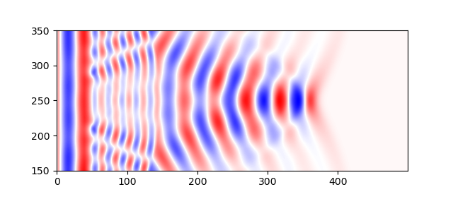

# FDTD simulation

This is my implementation of a EM wave propagation simulated using FDTD as a final project for PHYS 611(F21)

## 1D Simulation

- [x] Absorbing boundary condition implemented for epsilon=1 
- [x] simulate devices

## 2D simulation

- [x] Basic 2D engine
- [ ] PML boundary 
- [x] Simulate lens/block of material

## Sample simulations

A plane wave interaction with a plano-convex lens

